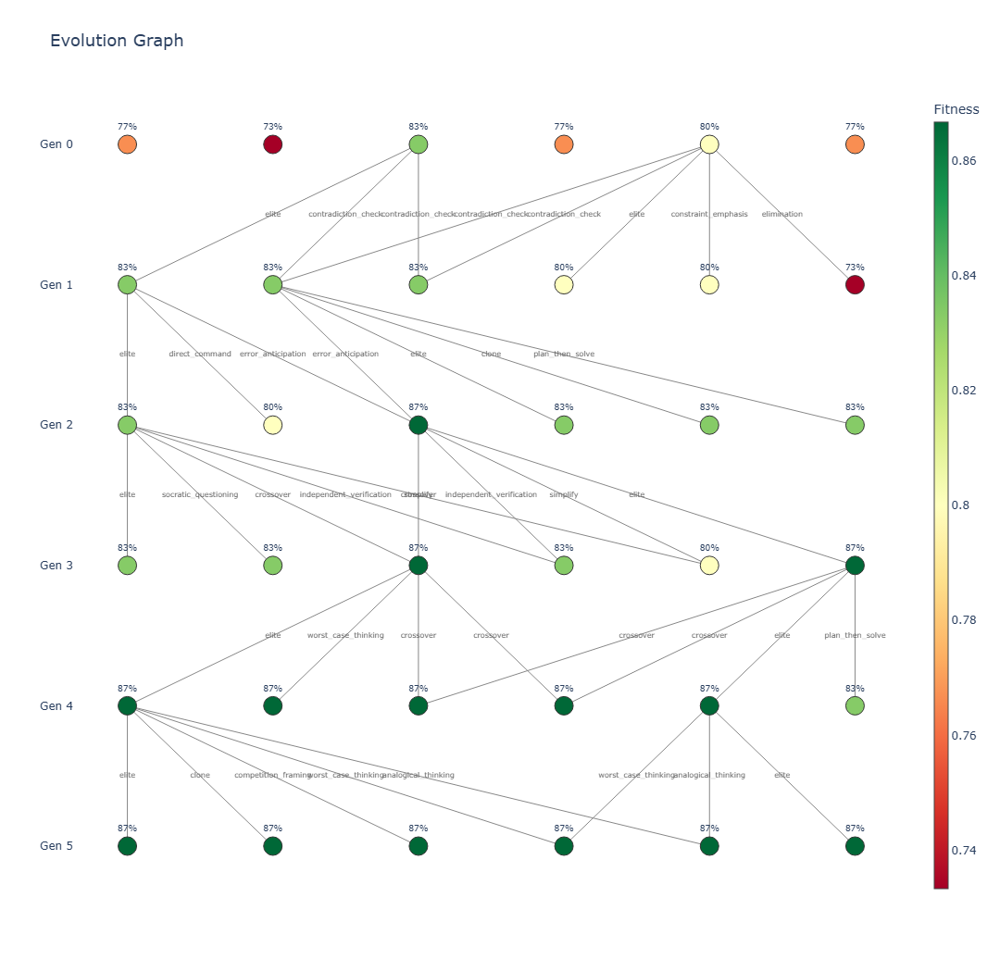

# EvoPrompts

> **Work in progress.** This is an experiment. A lot of things are unpolished, defaults keep changing, some decisions are temporary.

Evolutionary optimization of system prompts for LLMs. Instead of manually iterating on prompts — a genetic algorithm where each generation of prompts is evaluated on a dataset, the best survive, cross over, and mutate.

## Idea

The project takes a classic genetic algorithm and maps it onto the problem of **prompt optimization**. Normally a GA evolves a population of candidate solutions (bitstrings, parameter vectors, programs) against a fitness function. Here, the "organism" is a natural-language system prompt, and the "fitness function" is how well that prompt makes an LLM answer questions from a dataset correctly.

Mapping from classical GA concepts to prompt optimization:

| GA concept          | In EvoPrompts                                                                 |
| ------------------- | ----------------------------------------------------------------------------- |
| Individual / genome | A system prompt (free-form text).                                             |
| Population          | N prompts kept alive at the same time.                                        |
| Fitness             | Accuracy of Mortal answering dataset questions when steered by that prompt.   |
| Seeding             | God generates diverse variants of the user's initial prompt.                  |
| Selection           | Top-k by fitness (elites carry over unchanged).                               |
| Crossover           | God combines the strongest elements of two parent prompts.                    |
| Mutation            | God applies one of 40 named transformations (add CoT, simplify, ...).         |
| Stop condition      | Fitness plateau over N generations, or max generations hit.                   |

The unusual part is that **every evolutionary operator is driven by a single LLM** — we call it `evolution_llm`, or just `God`. God is the one who seeds the initial population, combines parents into children, and applies mutations. There are no string-level crossovers, no random character edits, no hand-written templates doing the rewriting — every change to a prompt is a natural-language instruction handed to God, who rewrites the prompt accordingly. This lets the search move through semantic space rather than edit-distance space.

A separate, cheaper `inference_llm`, so called `Mortal`, only plays the role of the subject under test. Mortal receives the prompts God has written and executes them against the actual dataset so we can measure fitness. Mortal never modifies prompts; it just obeys them. God creates and rewrites, Mortal lives by what God wrote.

The loop:

```
seed population → evaluate → selection → crossover → mutation → evaluate → ...
                                ↓
                         stop (plateau / max_gen)
```

Two LLMs play different roles:

- `evolution_llm` (aka **God**) — performs every evolutionary operation: generates the initial population, crosses prompts over, applies all 40 mutations (gpt-5-nano, reasoning=medium). Needs to be good at creative rewriting and following instructions about how to improve a prompt.
- `inference_llm` (aka **Mortal**) — the subject under test. Runs the evolved prompts on dataset tasks (gemini-3.1-flash-lite). Never rewrites anything — we're measuring how well a given prompt makes *Mortal* answer correctly.

Input: an initial prompt + a dataset of `(question, expected_answer)` pairs.
Output: an evolution map (plotly `graph.html`) plus all intermediate states saved as JSON, so the full lineage of every prompt — who its parents were, which mutation produced it, how fitness changed — can be replayed after the fact.

## Mutations

40 LLM-based operators across 4 categories:

- **Core** (8): rephrase, simplify, minimalist, persona, constraint_emphasis, output_format, precision_emphasis, direct_command
- **Reasoning** (16): add_cot, decomposition, backward/analogical/causal/first-principles/Socratic reasoning, hypothesis testing, edge case analysis, multi-perspective, meta-cognitive, plan-then-solve, self-debate, chain-of-verification, etc.
- **Verification & Accuracy** (11): self_verification, confidence_score, sanity_check, double_check_arithmetic, error_anticipation, independent_verification, unit_check, etc.
- **Domain & Style** (5): academic_tone, teacher/competition/expert_panel framing, verbose_explicit

All reasoning-type mutations include a guard: "reason INTERNALLY, output ONLY the final answer" — so they don't break exact-match eval.

## Example run

A small run on the first 30 GSM8K test problems with `population_size=6`, `top_k=2`, both LLM roles served by `gpt-5-nano` (`evolution_llm` at `reasoning=medium`, `inference_llm` at `reasoning=minimal`). Snapshots from this run live in [`docs/example/`](docs/example/).

The user supplied a deliberately bare initial prompt:

> *"Answer this question. Provide only the exact final answer, nothing else."*

That prompt landed at the bottom of generation 0 with **76.67%** accuracy. By generation 5 the population converged on a single elite at **86.67%**:

> *"Take on the persona of an elite, rigorously precise problem-solver. For every user question, perform an internal contradiction check and a structured internal evaluation to determine the unique correct final answer. You may conduct internal, step-by-step reasoning to verify the solution, but you must not reveal that reasoning in your output. Before answering, internally verify that there are no contradictions in your reasoning; if contradictions are detected, resolve them internally to maintain a consistent conclusion. If the question is ambiguous, apply the constraints and information provided to select the most defensible, determinate interpretation and final answer; do not ask for clarification. Additionally, internally anticipate common errors and misinterpretations for this type of problem and actively avoid them. After completing internal checks and error-prevention assessments, respond with ONLY the final answer—on a single line, with no extra words, punctuation, or formatting."*

What the winning prompt picked up over the baseline: an expert persona, an explicit *internal* reasoning step (so it does not waste output tokens on visible chain-of-thought), an internal contradiction check, error anticipation, and a strict "single line, final answer only" output discipline. None of those ideas were in the user's input — God assembled them from successive crossover and mutation steps, and the fitness function on GSM8K kept selecting them.

The full evolution graph:



## Run

```bash
pip install -r requirements.txt
# .env: OPENAI_API_KEY, GOOGLE_API_KEY, HF_TOKEN
python main.py
```

Results land in `output/<timestamp>/`:

- `genN_<step>.json` — snapshots at each step
- `genN_evaluate_details.json` — detailed Q&A pairs
- `genN_<step>_errors.json` — errors (policy violations, refusals, etc.)
- `graph.json` — evolution graph (nodes + edges)
- `evolution_graph.html` — plotly visualization

## Structure

```
evoprompts/
├── core/               # config, state, LLM clients, LangGraph
├── data/               # dataset loading + output/graph saving
├── steps/              # evolution graph nodes
│   ├── seed_step.py        # generate initial population
│   ├── evaluate_step.py    # fitness evaluation (exact match + normalization)
│   ├── select_step.py      # stop-condition check
│   ├── evolve_step.py      # selection (top-k) + crossover
│   └── mutation_step.py    # 40 mutation operators
├── cli/                # entry point, visualization
└── output/<timestamp>/ # per-step JSONs + graph.html
```
